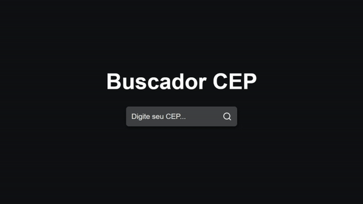

<h1 align="center"> Buscador de Cep </h1>

Projeto criado com para consumir API ViaCEP.  

  <a href="#-tecnologias">Tecnologias</a>&nbsp;&nbsp;&nbsp;|&nbsp;&nbsp;&nbsp;
  <a href="#-projeto">Projeto</a>&nbsp;&nbsp;&nbsp;|&nbsp;&nbsp;&nbsp;
  <a href="#-layout">Layout</a>&nbsp;&nbsp;&nbsp;|&nbsp;&nbsp;&nbsp;
  <a href="#memo-licença">Licença</a>

  

 

  

## 🚀 Tecnologias

Esse projeto foi desenvolvido com as seguintes tecnologias:

- ReactJs
- CSS
- Axios
- Git e Github

## 💻 Projeto

É um projeto para consultar Códigos de Endereçamento Postal (CEP) do Brasil.

- [Acesse o projeto finalizado, online](https://jessica-guedes.github.io/buscador-cep)

Esse projeto está sob a licença MIT.

---

